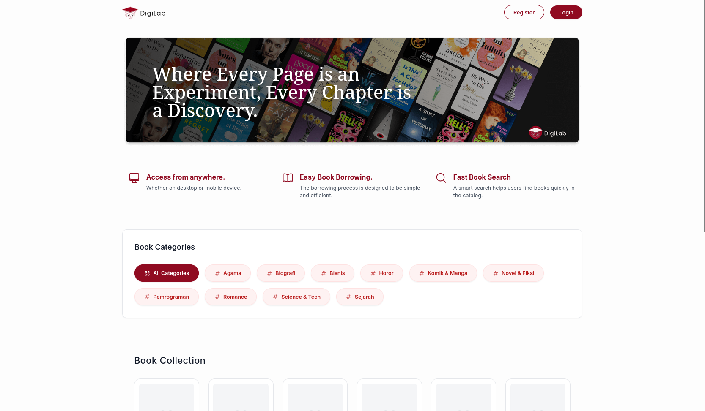
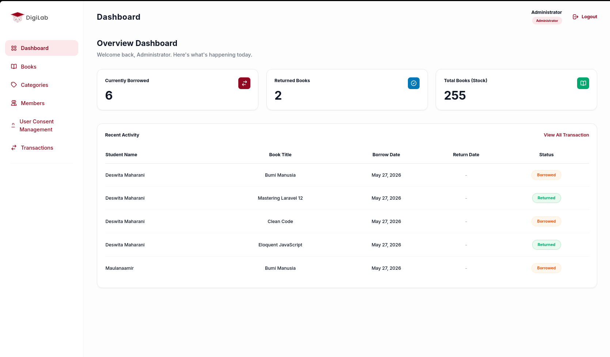
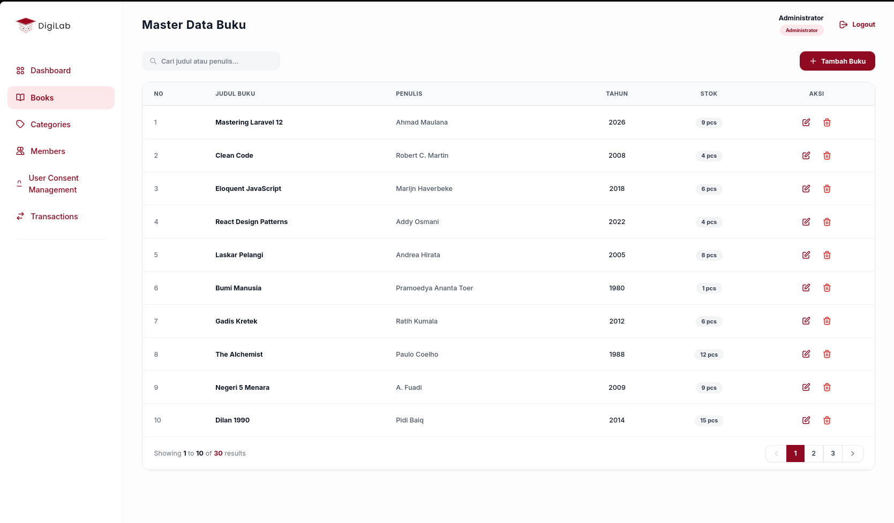
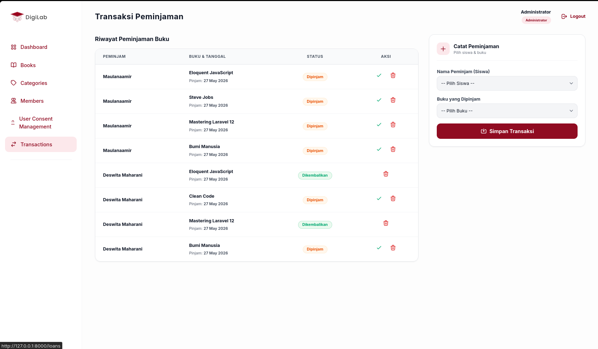
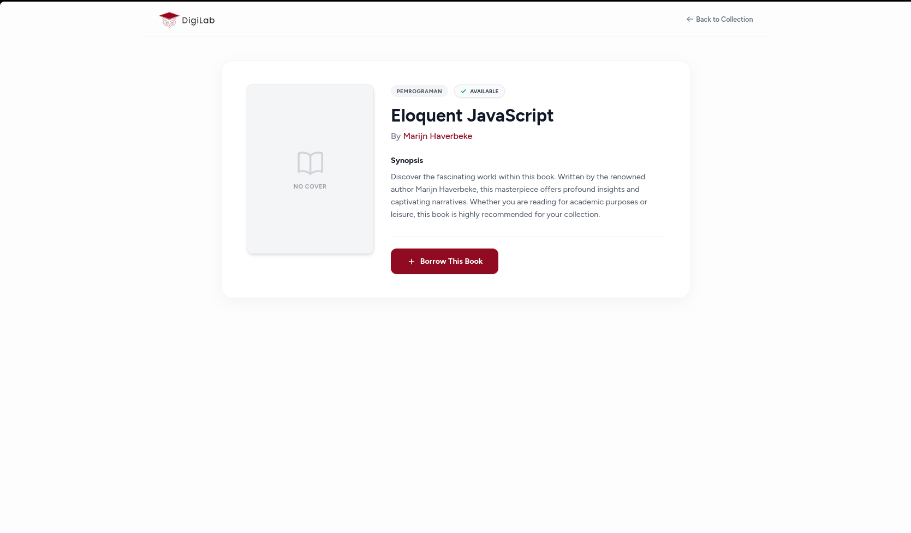
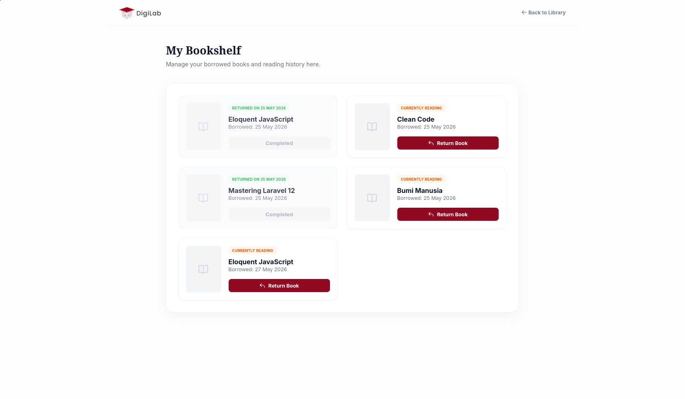
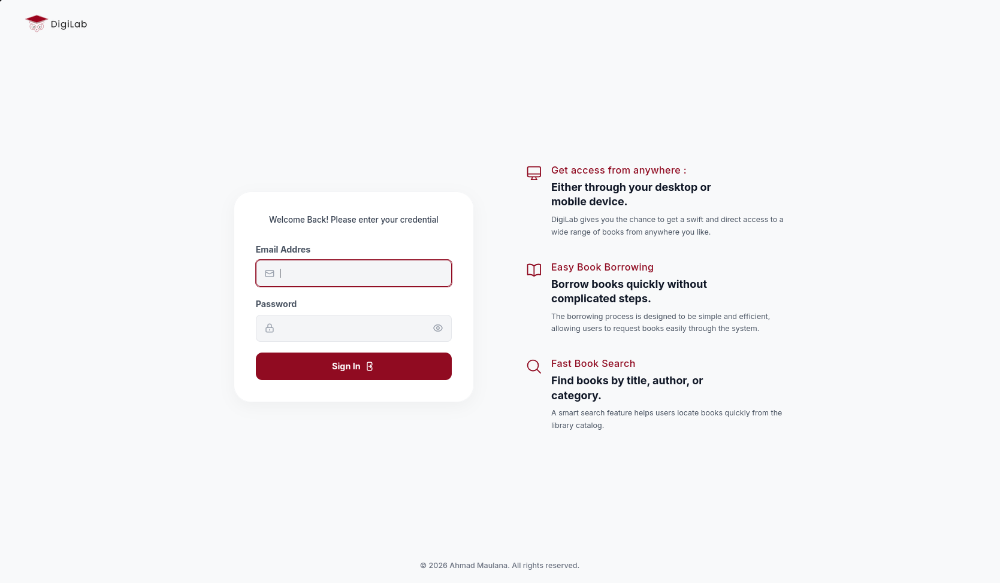

# DigiLab Library Management System


A modern web-based library management system built using Laravel.
This project helps schools or institutions manage books, borrowing activities, returns, and member data more efficiently through a digital system.

---

# Preview

### Landing Page


### Dashboard


### Book Management


### Borrowing System




### Return Management


### User Authentication


---

# Features

* Authentication & Authorization
* Book Management CRUD
* Category Management
* Borrowing Books
* Returning Books
* Search & Filter Books
* Responsive Admin Dashboard
* User Management
* Borrow History

---

# Tech Stack

### Backend

* PHP
* Laravel

### Frontend

* Blade Template
* Bootstrap / Tailwind CSS

### Database

* MySQL

### Tools

* Composer
* NPM
* Vite

---

# Installation

## Clone Repository

```bash
git clone https://github.com/Maulanaamir/DigiLab-LibraryManagement.git
```

## Move to Project Folder

```bash
cd DigiLab-LibraryManagement
```

## Install Dependencies

```bash
composer install
npm install
```

## Copy Environment File

```bash
cp .env.example .env
```

## Generate Application Key

```bash
php artisan key:generate
```

---

# Database Configuration

Open `.env` file and configure your database:

```env
DB_CONNECTION=mysql
DB_HOST=127.0.0.1
DB_PORT=3306
DB_DATABASE=digilab_library
DB_USERNAME=root
DB_PASSWORD=
```

---

# Run Migration

```bash
php artisan migrate
```

If your project uses seeders:

```bash
php artisan db:seed
```

---

# Run Development Server

```bash
php artisan serve
npm run dev
```

Server will run on:

```bash
http://127.0.0.1:8000
```

---

# Project Structure

```bash
app/
routes/
resources/
database/
public/
```

---

# Future Improvements

* QR Code Borrowing System
* Book Recommendation System
* Export PDF Reports
* Email Notifications
* Dark Mode UI
* Multi-role Authentication
* REST API Integration

---

# Purpose of This Project

This project was originally developed as a school/industrial class project and is currently being improved and redesigned as part of my personal portfolio.

---

# Author

Ahmad Maulana

* GitHub: https://github.com/Maulanaamir
* Instagram: @achmadmaulanaamirudin

---

# License

This project is open-sourced software licensed under the MIT license.
